= 🏠 Télétravail Asynchrone 🧑‍💻 
:source-highlighter: highlightjs
:revealjs_theme: white
:revealjs_history: true
:revealjs_plugin_pdf: enabled
:revealjs_plugin_highlight: enabled
:revealjs_progress: true
:customcss: custom.css
:data-uri:
:icons: font

++++

#devoxxfr2023 #alan

++++

== Benoit Prioux

image::images/{conf}-background.png[background, size=cover]

icon:twitter[] icon:github[] binout 

image::images/alan-eng.jpeg[]

== 💜 Alan, partenaire santé

image::images/{conf}-background.png[background, size=cover]

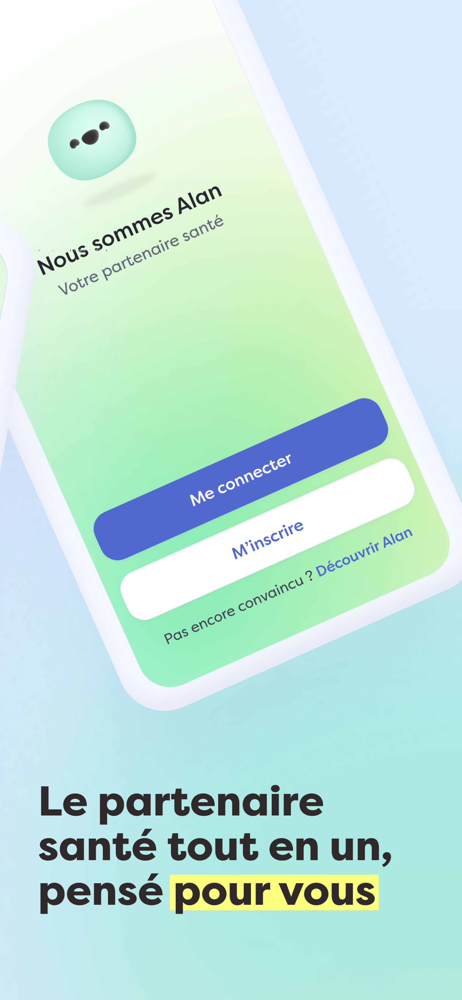
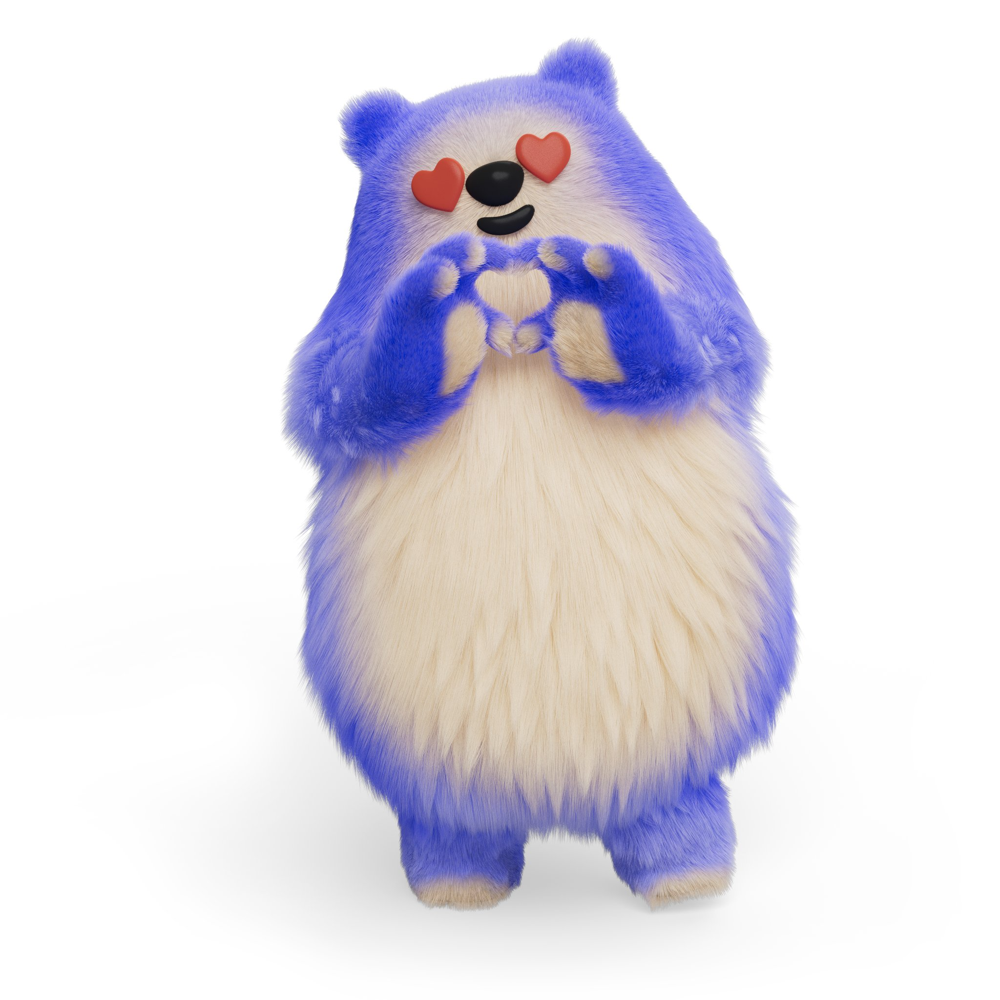
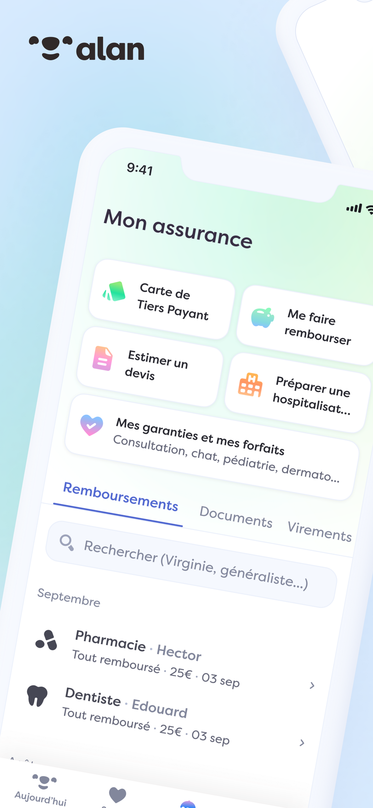

== 🌱 Culture d'entreprise Alan

image::images/{conf}-background.png[background, size=cover]

✍️ Culture de l'écrit

🫥 Transparence radicale

🤩 Pas de réunions, pas de managers

👑 Responsabilité distribuée

🧑‍💻 Travail flexible 

➡️ https://medium.com/alan

== 🧸 Twitter pour gagner

#devoxxfr2023 #alan

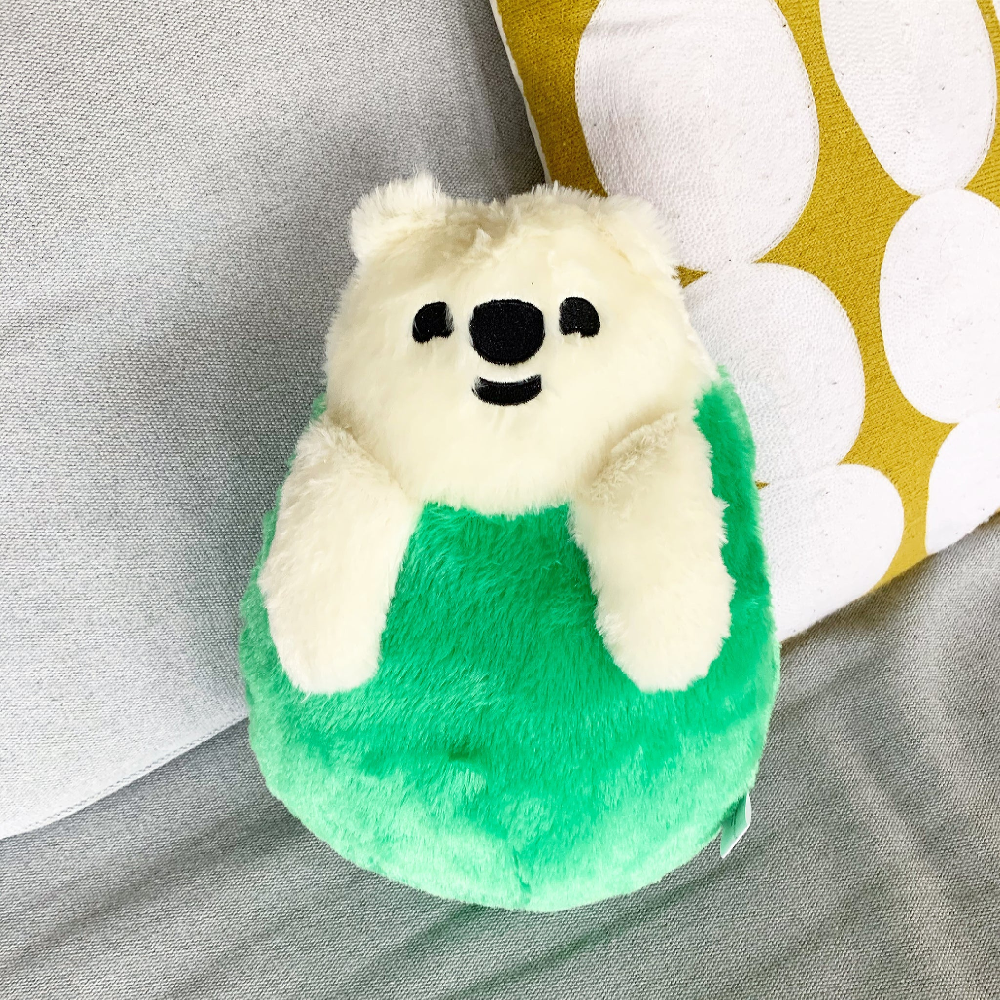

== 🤖 Télétravail Asynchrone par ChatGPT

image::images/{conf}-background.png[background, size=cover]

---
Le télétravail asynchrone est une **pratique de travail à distance** qui permet aux travailleurs de travailler de manière **autonome** avec des outils de **communication asynchrones**, offrant plus de **flexibilité** et de **productivité**, mais qui peut également présenter des **défis** de communication et de collaboration.

---

== 🗣️ Communication Asynchrone

image::images/{conf}-background.png[background, size=cover]

== 🤔 Enjeux

image::images/{conf}-background.png[background, size=cover]

* 🤝 Transmission de l'information 
* 🧑‍💻 Collaboration
* 🎯 Alignement sur la stratégie
* 🤔 Gestion des notifications

== 💜 Communication chez Alan

image::images/{conf}-background.png[background, size=cover]

* ✍️ Tout est écrit
* 🗣️ Tout est publique (en interne)
* 🧑‍🏫 Tout le monde est formé

== 📣 Outil: Slack

image::images/{conf}-background.png[background, size=cover]
image:images/slack.png[float="right"]

* Pas de channel privé
* Pas de message privé

== Outil: Slack normé

image::images/{conf}-background.png[background, size=cover]

* 👮‍♀️ Règles de nommage `#crew_XXX`, `#team_XXX`, `#announcement`
* 🧵 Utilisation des threads 

== Outil: Slack formaté

image::images/{conf}-background.png[background, size=cover]

* 📖 Format des messages: Titre, Contexte, Questions, Actions
* 🔔 Ping des bonnes personnes

== Exemple: Daily 

image::images/{conf}-background.png[background, size=cover]
image:images/slack.png[float="right"]

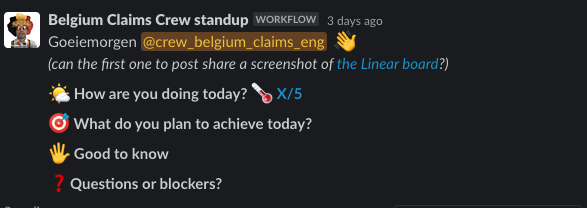

== Exemple: Daily 

image::images/{conf}-background.png[background, size=cover]
image:images/slack.png[float="right"]

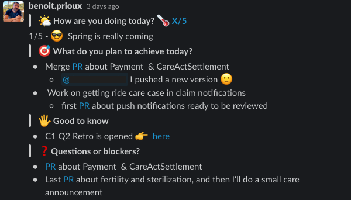

== Exemple: HPFO 

image::images/{conf}-background.png[background, size=cover]
image:images/slack.png[float="right"]

☀️**H**ighlights / 🎯**P**rogress 
🔥 **F**ires /  🚀**O**bjectives

📣 #org_alaner-hpfo

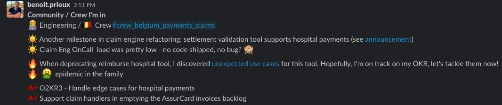

== Exemple: Thread pour soi

image::images/{conf}-background.png[background, size=cover]
image:images/slack.png[float="right"]

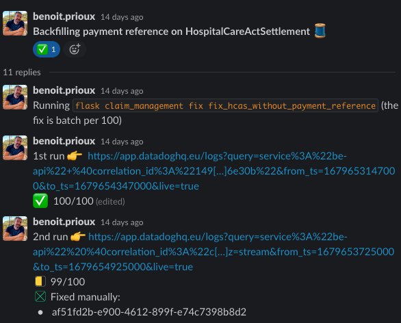

== Exemple: #team_retro

image::images/{conf}-background.png[background, size=cover]
image:images/slack.png[float="right"]

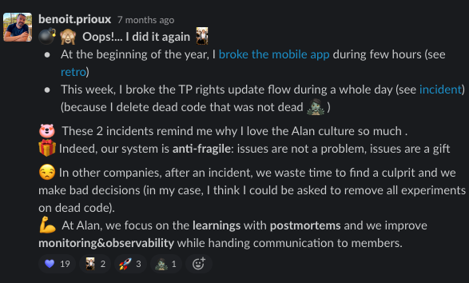

== Exemples: #team_praise 

image::images/{conf}-background.png[background, size=cover]
image:images/slack.png[float="right"]

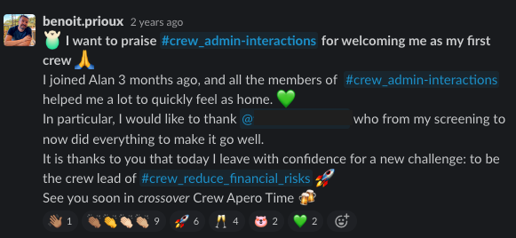

== 🧑‍⚖️ Processus de décision 

image::images/{conf}-background.png[background, size=cover]

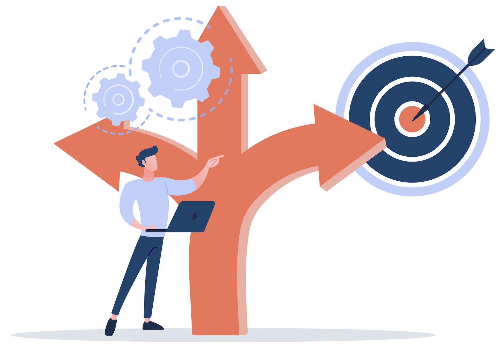

== 🤔 La réunion synchrone

image::images/{conf}-background.png[background, size=cover]

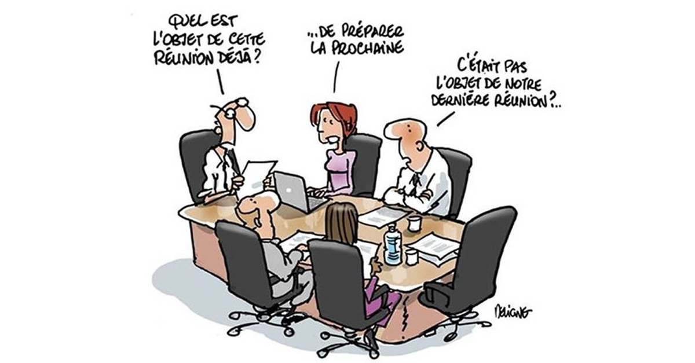

== 🤔 Retour sur investissement ?

image::images/{conf}-background.png[background, size=cover]

image::images/meeting-cost.png[width=45%]

== 💡 Pas de réunion chez Alan

image::images/{conf}-background.png[background, size=cover]
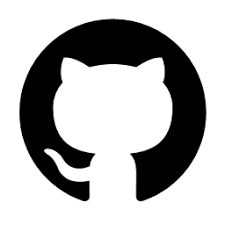

👋 Hello Github +++<s>Issue</s>+++ Discussion

➡️ https://blog.alan.com/bien-etre-au-travail/no-meeting-policy

== Comment ça marche ?

image::images/{conf}-background.png[background, size=cover]

1. 🤔 J'explique pourquoi 
2. 📖 Je décris le contexte et la timeline
3. 💡 Je présente ma ou mes propositions
4. 🔔 Je ping mes collègues
5. 🥹 J'attends les contributions
6. 👍 Je prends en compte les remarques (ou pas)
7. 👑 Je conclus en actant une décision

== Exemple: Template

image::images/{conf}-background.png[background, size=cover]

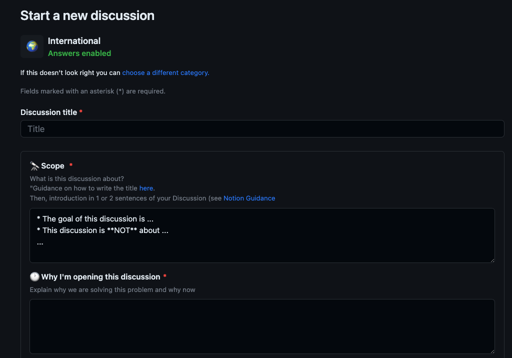

== Exemple: Template

image::images/{conf}-background.png[background, size=cover]

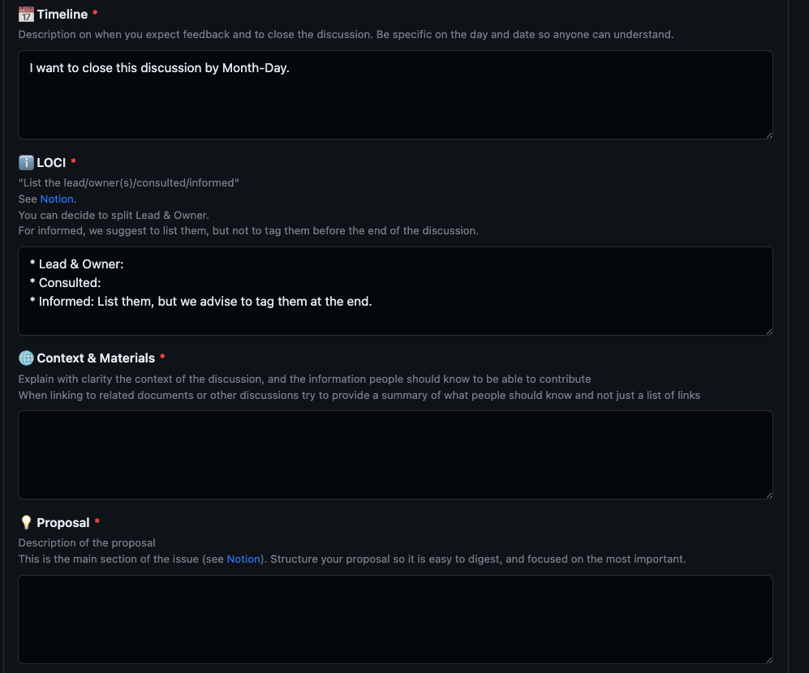

== Exemple: Discussion

image::images/{conf}-background.png[background, size=cover]

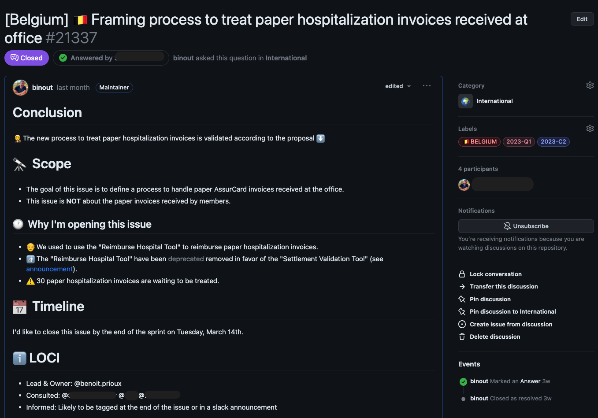

== 🤪 Tout décision peut devenir une discussion

image::images/{conf}-background.png[background, size=cover]

* Conception fonctionnelle / technique
* Planning
* Retro
* Gestion d'une absence longue durée
* Offsite ... 

== Retour d'expérience

image::images/{conf}-background.png[background, size=cover]

* 💪 Apprendre à ouvrir une discussion
* 🤩 Qualité de la réfléxion
* ⏳ Meilleur organisation du temps
* 👀 Transparence totale

== 👫 Pas de réunions mais...

image::images/{conf}-background.png[background, size=cover]

* des 1-1s
* des sessions de pair-programming
* des événements d'équipes

== Après la décision, on documente

image::images/{conf}-background.png[background, size=cover]

* Github Discussions 👉 contexte des décisions
* Notion 👉 Documentation de la _vérité du moment_

image::images/notion.png[]

== Outils : Notion

image::images/{conf}-background.png[background, size=cover]

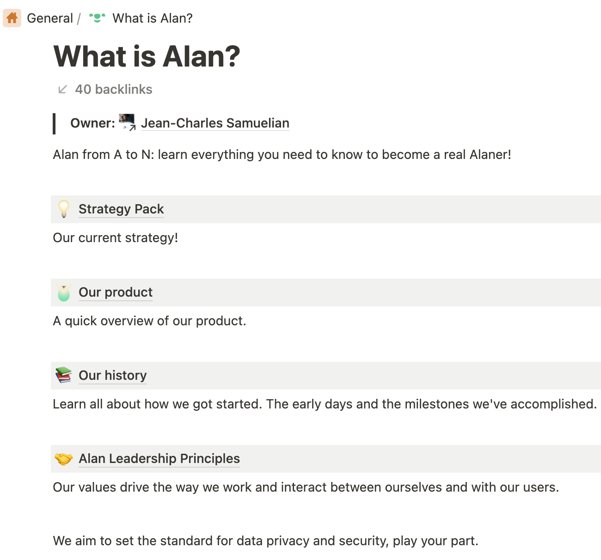

== 🚀 Autonomie

image::images/{conf}-background.png[background, size=cover]

== 🤔 Enjeux

image::images/{conf}-background.png[background, size=cover]

* 🤝 Auto-formation
* 🧑‍💻 Cohérence globale
* ⏱️ Gestion du temps
* 🧐 Chercher vs demander de l'aide

== 🕳️🪜 Falling into The Pit of Success

image::images/{conf}-background.png[background, size=cover]

* Vous empêcher de faire les mauvais choix
* Vous aider à faire les bons choix

➡️ https://medium.com/alan/falling-into-the-pit-of-success-726dda873fae

== 🪝 Outils: Pre-commit hooks

image::images/{conf}-background.png[background, size=cover]

* Formatage du code
* Linter pour vérifier les bonnes pratiques (💡 si pas respecté, lien vers la documentation)
* Vérification de sécurité (👮‍♀️ pas de secrets commités)

== 🧪 Outils: Tests unitaires

image::images/{conf}-background.png[background, size=cover]

* pour vérifier le bon format d'un fichier de configuration
* pour s'assurer du respect d'un design d'architecture
* pour remplacer certains TODOs

== 🤩 Developper Experience

image::images/{conf}-background.png[background, size=cover]

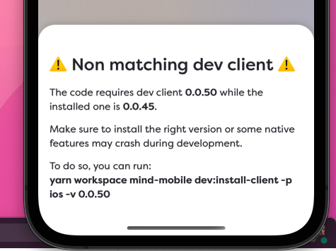

== 🤖 Automation 

image::images/{conf}-background.png[background, size=cover]

* Automatiser les tâches répétitives
* Guider et uniformiser les processus

== Outils: Slack Bot 

image::images/{conf}-background.png[background, size=cover]

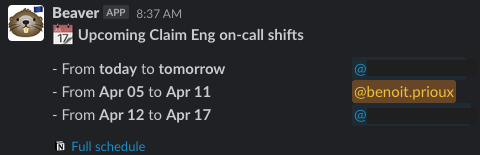

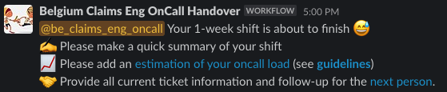

== Outils: Slack Bot

image::images/{conf}-background.png[background, size=cover]

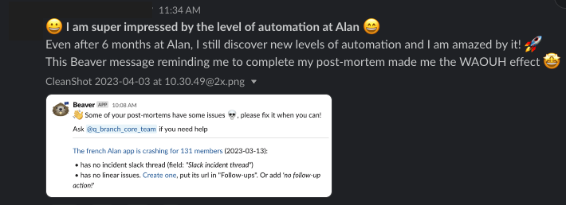

== 🤖 Assistance par l'IA

image::images/{conf}-background.png[background, size=cover]

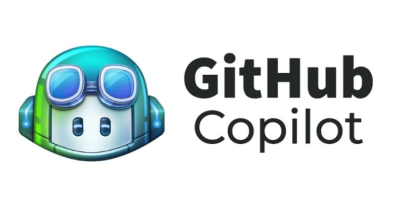

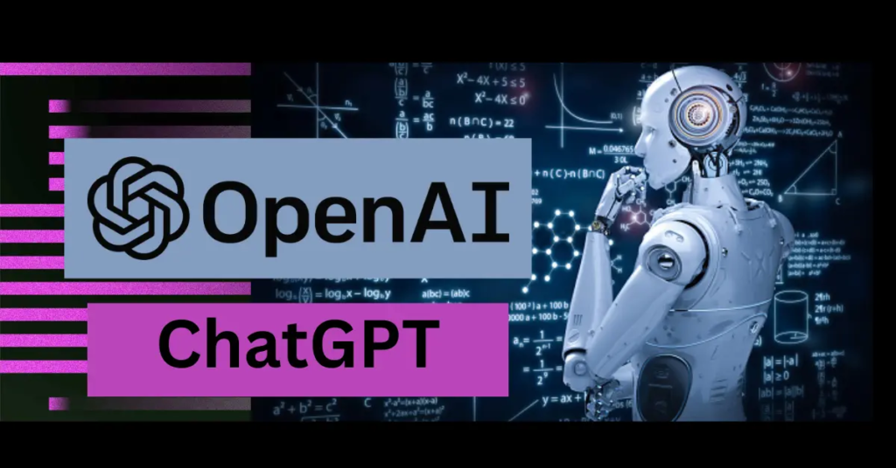

== Pour résumer

image::images/{conf}-background.png[background, size=cover]

== 🤓 Fondations

image::images/{conf}-background.png[background, size=cover]

* Communication publique et écrite
* Processus de décision asynchrone et écrit
* Autonomie des équipes

== 🏆 Ce qu'on y gagne

image::images/{conf}-background.png[background, size=cover]

* Efficacité à l'échelle
* Travail flexible
* Responsabilité

== 👀 Points d'attention

image::images/{conf}-background.png[background, size=cover]

* Très lié à la culture d'entreprise
* Demande un engagement personnel
* Besoin d'initiatives pour le lien social

== Merci 🙏

image::images/{conf}-background.png[background, size=cover]

👨‍🏫 https://binout.github.io/async-remote-work/

**🚀 Intéressé ?  ➡️ https://alan.com/careers**